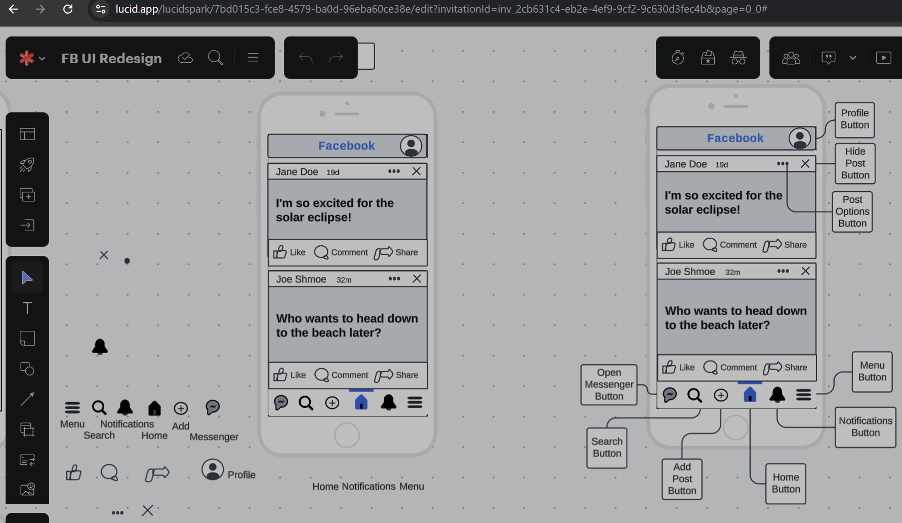
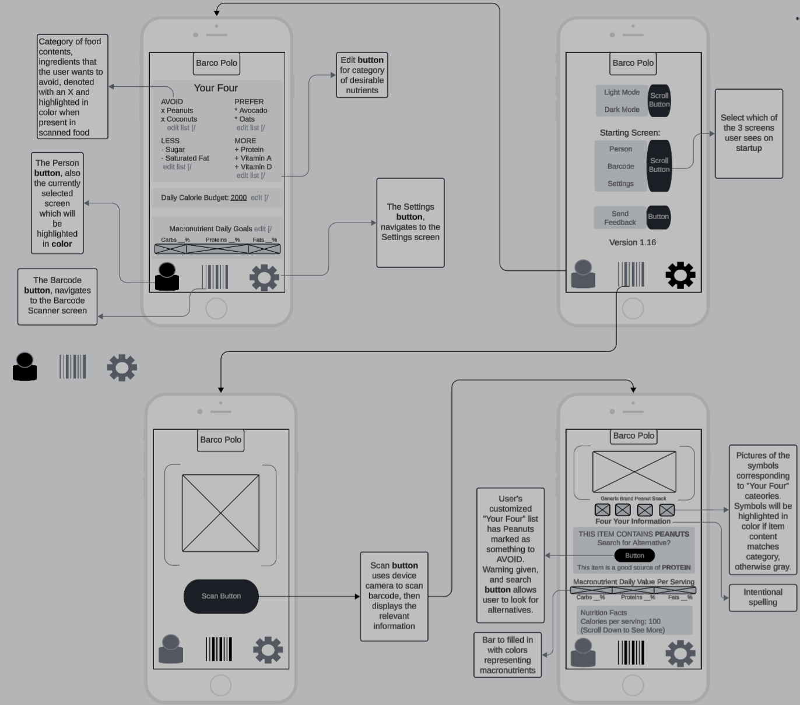

# CS360_Portfolio
//Throughout this course, I was tasked with developing mobile applications, and special attention was given to designing the UI and UX, ensuring that the users were able to comfortably and conveniently access everything they needed to achieve their intended purpose.
Below are some samplings of my UI/UX prototyping and wireframing:

//Briefly summarize the requirements and goals of the app you developed. What user needs was this app designed to address?// 

The goal of the app was to create a way for the user to manage inventory. The user needed to be able to create a profile, sign in, and access their inventories. The user needed the ability to add items, change their quantities, and delete items. The user also needed to have SMS notifications that warned them when an item ran out. This would allow the user to keep track of their items whenever they use the app. 

//What screens and features were necessary to support user needs and produce a user-centered UI for the app? How did your UI designs keep users in mind? Why were your designs successful?// 

A login screen was required for the user to be able to sign in, and the design for this was fairly simple, only needing the option to enter credentials, submit them, or create a new account. I kept the elements spaced out from each other and made sure they were not too small as to be unreadable. 

//How did you approach the process of coding your app? What techniques or strategies did you use? How could those be applied in the future?// 

The strategy I employed here was evolving in the middle of development, and as such the result was a bit messy. I tried to design the app’s look before implementing functionality, which in a sense was useful to see the end goal. However, implementing that functionality was more difficult than the User Interface design made it appear. 

//How did you test to ensure your code was functional? Why is this process important and what did it reveal?// 

Normally I would write unit tests, such as JUnit, however most of the testing I did for this app was manual, and it revealed quite a few issues where I forgot to link certain UI elements to their variables and the functional code, so even though it might have worked in the background, nothing would be happening on the screen. It is useful to see these kinds of issues as the app is running on an emulated screen, rather than simply running the code and thinking that everything is working without visual evidence. 

//Considering the full app design and development process, from initial planning to finalization, where did you have to innovate to overcome a challenge?// 

In the cases where data was meant to be created and it did not appear to be, I used Toast messages to confirm that the desired actions were taking place. I also made use of DB Browser for SQLite to look into the database and confirm that it had indeed been created and contained data. 

//In what specific component from your mobile app were you particularly successful in demonstrating your knowledge, skills, and experience?// 

I would say the design of my UI was probably the best part of the app, since a good portion of the app’s functionality was never fully realized. I made sure to only use a few colors to not overwhelm the user, made sure to space things out so as not to collide with each other, and used a consistent theme throughout. The teal background was contrasted with darker elements framing text fields and interactive input; Lighter elements highlighted the branding, the current screen selected, and important buttons that could be clicked. Navigational elements remained accessible, and there were no such buttons at the top of the screen, or consequently, out of reach. Text on dark backgrounds was contrasted enough to be readable. This was intended to give the users an easier time of quickly seeing what they need to, and being visually drawn to the actions they are going to be taking while on the app. 
